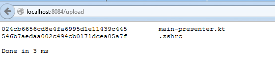

# Kotlin goes reactive with Vert.x 3

Reactive programming is gaining popularity every day. The main reason is that traditional thread blocking approach has a big
 disadvantage: a running application could get stuck if there are many requests that hold too many physical threads.
 [Kotlin](http://kotlinlang.org) is not an exception so due to the same reason Kotlin programming may be not so pleasant
 as it should be.

Fortunately there is [vert.x](http://vertx.io/) that helps you build
 [reactive](http://www.reactivemanifesto.org/) applications. With the new
 [vertx3-lang-kotlin](https://github.com/cy6erGn0m/vertx3-lang-kotlin) and
  [RxKotlin](https://github.com/ReactiveX/RxKotlin) it becomes even better.

# Getting started

With vertx you can build your application from small reactive event-driven componets. There are many available [components](http://vertx.io/docs/) that cover many aspects of modern application development. Since Kotlin has [SAM conversion features](http://kotlinlang.org/docs/reference/java-interop.html#sam-conversions), you can easily assign asynchronous event handlers with lambdas 

```kotlin
eventbus.send(message) { result ->
    println("Sent or failed")
}
```

Using the Kotlin [`when` statement](http://kotlinlang.org/docs/reference/control-flow.html#when-expression),
you can make the code even better if you need error handling (generally you do)

```kotlin
import io.vertx.lang.kotlin.*
// .....
eventbus.send(message) { result ->
    when (result) {
        is AsyncResultSuccess -> println("Sent")
        is AsyncResultFailed -> println("Failed due to ${result.error}")
    }
}
```

Unfortunately with this approach it is easy to reach the so-called [callback hell](http://callbackhell.com/):

```kotlin
// never do like this
eventbus.send(message) { result ->
    when (result) {
        is AsyncResultSuccess -> {
            eventbus.send(another) { result ->
                when (result) {
                    is AsyncResultSuccess -> {
                        eventbus.send(oneMore) { result ->
                            when (result) {
                                is AsyncResultSuccess -> {
                                    ....
                                }
                                is AsyncResultFailed -> println("Failed due to ${result.error}")
                            }
                        }
                    }
                    is AsyncResultFailed -> println("Failed due to ${result.error}")
                } 
            }
        }
        is AsyncResultFailed -> println("Failed due to ${result.error}")
    }
}
```

One of the solutions is to use reactive streams. Vert.x 3 has built-in [vert.x RxJava support](https://github.com/vert-x3/vertx-rx) so with RxKotlin you can make asynchronous chains look much better

```kotlin
eventbus.send(message)
    .flatMap { eventbus.send(another) }
    .flatMap { eventbus.send(oneMore) }
    .doOnError { println("Message sending chain failed due to ${it.getCause()}") }
    .doOnComplete { println("All messages sent") }
    .subscribe()
```

Looks too cool, isn't it? Well, there is nothing completely perfect in real life. If you look deeper you can find some disappointing cases. For example there is no Rx adapter for file upload handling. Fortunately with Kotlin it is easy to extend the API:

```kotlin
fun HttpServerRequest.fileUploadsObservable(): Observable<HttpServerFileUpload> = observable { subscriber ->
    uploadHandler { file ->
        subscriber.onNext(file)
    }
    endHandler {
        subscriber.onCompleted()
    }
    exceptionHandler {
        subscriber.onError(it)
    }
}
```

Notice `observable` function of RxKotlin that is useful for creating observables. 

# Working example

Let's proceed with a simple example to demonstrate a full working application, that handles md5 hashes for file that a user can upload from a form.

First of all lets start with an empty HTTP server

```kotlin
import io.vertx.kotlin.lang.*

fun main(args: Array<String>) {
    DefaultVertx {
        httpServer(8084) { request ->
            val response = request.response()
            response.contentType("text/plain")
            response.body {
                replyText("Hello, world!")
            }
        }
    }
}
```

This server does nothing except echo the same text. We can respond
 with some JSON instead:

```kotlin
import io.vertx.kotlin.lang.*
import io.vertx.kotlin.lang.json.object_

fun main(args: Array<String>) {
    DefaultVertx {
        httpServer(8084) { request ->
            val response = request.response()
            response.contentType("application/json")
            response.body {
                replyJson {
                    object_(
                            "os.name" to System.getProperty("os.name"),
                            "processors" to Runtime.getRuntime().availableProcessors(),
                            "agents" to listOf("Master", "Slave1", "Slave2")
                    )
                }
            }
        }
    }
}
```

Once running it in the browser we can see the following JSON

```json
{"os.name":"Linux","processors":8,"agents":["Master","Slave1","Slave2"]}

```

Quick and simple, isn't it? Well, we have this response to _any_ request but what if we need more control? We can
 use the  `httproute` provided by vertx3-lang-kotlin library

```kotlin
import io.vertx.kotlin.lang.*
import io.vertx.kotlin.lang.json.object_

fun main(args: Array<String>) {
    DefaultVertx {
        httpServer(8084, block = Route {
            GET("/") {
                contentType("text/plain")
                replyText("Hello, world!")
            }
            GET("/info") {
                contentType("application/json")
                bodyJson {
                    object_(
                            "os.name" to System.getProperty("os.name"),
                            "processors" to Runtime.getRuntime().availableProcessors(),
                            "agents" to listOf("Master", "Slave1", "Slave2")
                    )
                }
            }
        })
    }
}
```

Notice functions `Route` and `GET`  aasemble lambdas for us to get the corresponding request handler. Also it
does a bit magic to get the code even shorter because `this` will be reassigned to response.

What about 404 then? Let's add it too:

```kotlin
fun main(args: Array<String>) {
    DefaultVertx {
        httpServer(8084, block = Route {
            GET("/") {
                contentType("text/plain")
                replyText("Hello, world!")
            }
            GET("/info") {
                contentType("application/json")
                bodyJson {
                    object_(
                            "os.name" to System.getProperty("os.name"),
                            "processors" to Runtime.getRuntime().availableProcessors(),
                            "agents" to listOf("Master", "Slave1", "Slave2")
                    )
                }
            }
            otherwise {
                setStatus(HttpResponseStatus.NOT_FOUND, "Not found")
                contentType("text/plain")
                replyText("The requested resource ${it.path()} was not found")
            }
        })
    }
}
```

We still haven't added the start page though, so let's do that (in real life we might not want static pages). As it is just an example, we'll omit the required configurations. In a 
 real application, we may also need a template engine. 

So first of all we'll place the [index.html](../src/examples/kotlin-vertx3-blog-example/src/main/resources/index.html) page to the resources directory and load its content:

```kotlin
val indexPage = ClassLoader.getSystemResourceAsStream("index.html")?.readBytes() 
                            ?: throw IllegalStateException("No index.html page found")
val indexPageBuffer = bufferOf(indexPage)
```

after that it is easy to use it in `GET("/")`

```kotlin
GET("/") { request ->
    contentType("text/html", "UTF-8")
    body {
        write(indexPageBuffer)
    }
}
```

Finally we have to introduce a file upload handler at `/upload`

```kotlin
POST("/upload") { request ->
    request.setExpectMultipart(true)
    contentType("text/plain", "UTF-8")
    setChunked(true)
    val start = System.currentTimeMillis()

    request.uploadHandler { file ->  // for each file upload
        val md5sum = MessageDigest.getInstance("MD5")  // create it's own MessageDigest instance
        val fileName = file.filename()
        var updated = false  // flag to handle empty form upload fields

        file.handler {    // for each received file block update digest
            md5sum.update(it.getBytes())
            updated = true
        }
        file.endHandler {   // when file upload completes for the file
            val digest = md5sum.digest().toHexString()   // compute message MD5 and convert bytes to HEX string
            if (updated || fileName.isNotBlank()) {   // we got any content or there was file name
                write("$digest\t$fileName\n")    // send digest for uploaded file
            }
        }
    }

    request.endHandler {  // at end let's print some stats to the generated page and end it
        end("\nProcessed in ${System.currentTimeMillis() - start} ms")
    }
}
```

Easy, isn't it? The only remaining thing is to handle errors. We can rewrite it using Rx reactive streaming in more functional manner.

For better readibility let's define two data classes:

```kotlin
data class NamedEntry<T>(val name: String, val entry: T)
data class DigestWithSize(val digest: MessageDigest, val size: Long)
```

And one function to update digest

```kotlin
fun DigestWithSize.update(bytes: ByteArray): DigestWithSize {
    digest.update(bytes)
    return copy(size = size + bytes.size())
}
```

We need to handle uploads Rx observable:

```kotlin
request.fileUploadsObservable()
        .flatMap { fileUpload ->
            fileUpload.toObservable()
                    .fold(DigestWithSize(MessageDigest.getInstance("MD5"), 0L)) { md, buffer -> md.update(buffer.getBytes()) }
                    .map { NamedEntry(fileUpload.filename(), it) }
        }
```

After that let's filter out empty fields and transform file digests to text:

```kotlin
.filter { it.entry.size > 0 || it.name.isNotBlank() }
    .map { "${it.entry.digest.digest().toHexString()}\t${it.name}" }
    .fold(StringBuilder(8192)) { sb, e -> sb.append(e).append("\n") }
    .map { sb -> sb.append("\nDone in ${System.currentTimeMillis() - start} ms\n").toString() }
```

Finally we write the generated text and handle errors:

```kotlin
.doOnNext { text ->
    val response = request.response()
    response.setChunked(true)
    response.end(text)
}
.doOnError { end("\n\nProcessing failed: ${it.getCause()}") }
.subscribe()
```

That's it. Let's run it with gradle

```bash
gradle runExample
```

and see the results in browser:



# What next

See [complete example project](../src/examples/kotlin-vertx3-blog-example). You can use it as a template for your playground. Visit [Kotlin Get Started page](http://kotlinlang.org/docs/tutorials/getting-started.html) and 
[Vert.x documentation page](http://vertx.io/docs/) to get more related information.

Aeel free to contribute to the [vertx3-lang-kotlin](https://github.com/cy6erGn0m/vertx3-lang-kotlin) 
if you have something to improve.

Stay tuned and be reactive!
